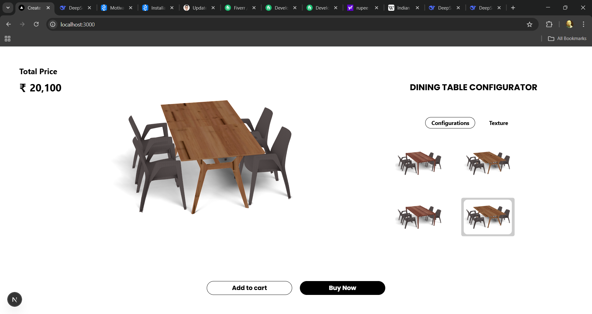

# Dining Table Configurator

An interactive web-based 3D configurator that allows users to customize a dining table by choosing layout options and textures for table and chair. Built with **React Three Fiber** and **Next.js**, this project provides a seamless and intuitive experience for designing the perfect dining table setup.

##  Features

-  Real-time 3D table preview
-  Texture customization for wood and Table
-  Layout selector for various table configurations
-  Smooth performance with WebGL React Three Fiber

##  Technologies Used

- [React Three Fiber](https://github.com/pmndrs/react-three-fiber)
- [Next.js](https://nextjs.org/)
- [Three.js](https://threejs.org/)
- [Drei](https://github.com/pmndrs/drei)
- [Tailwind CSS](https://tailwindcss.com/)

##  Screenshots



## 📦 Installation

Clone the repository:

```bash
git clone https://github.com/Rajnish8292/dining_table_configurator.git
cd dining-table-configurator
```

Install Dependencies : 
```bash
npm install
# or
yarn install
```

Run the development server : 
```bash

npm run dev
# or
yarn dev
```

Open http://localhost:3000 to view the configurator in your browser

## Author
Made by Rajnish Raj
### Connect on [LinkedIn](https://www.linkedin.com/in/rajnish-raj-9139602a4/)
